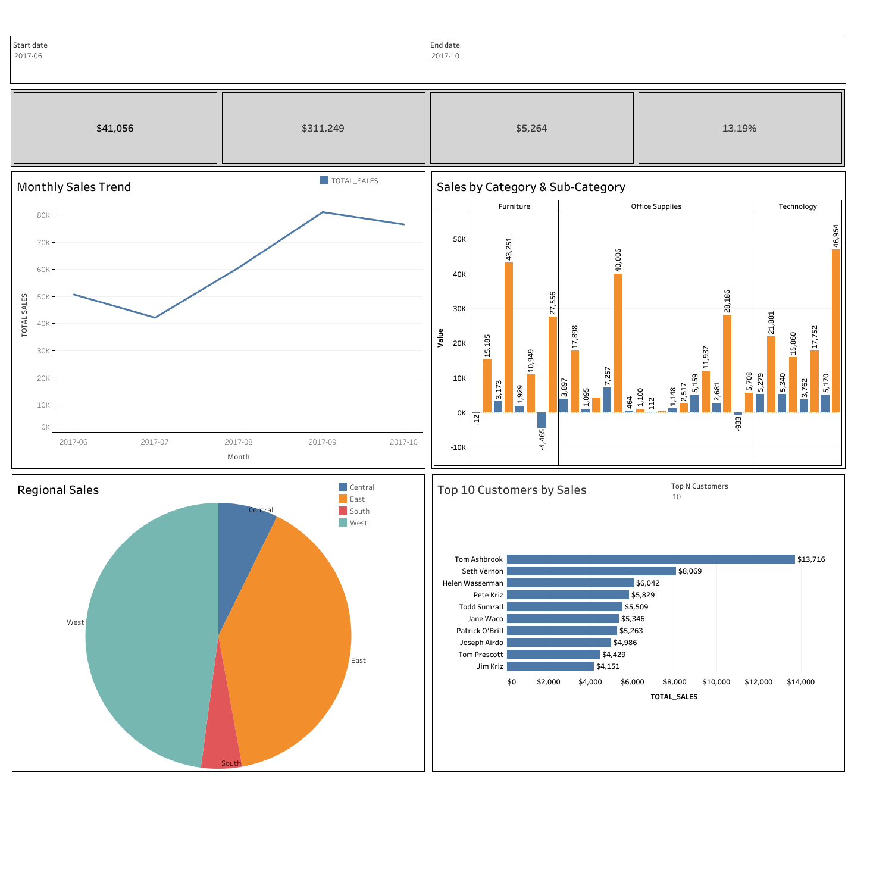

# 📊 Sales Dashboard using Snowflake + Tableau

### 🧠 Project Overview
This dashboard analyzes sales and profit performance using **Snowflake SQL** for data handling and **Tableau** for interactive visualizations.

### ⚙️ Tools Used
- Snowflake (Cloud Data Warehouse)
- Tableau (Visualization)
- SQL for data extraction and aggregation

### 🚀 Key Features
- KPI Cards for Sales, Profit, and Margin
- Monthly Sales Trend
- Category & Sub-Category Analysis
- Regional & City-Level Sales Map
- Top N Customer Analysis with Dynamic Parameters

### 🧩 Interactivity
- Dynamic Date Range Selector
- Metric Selector (Sales / Profit / Quantity)
- Multi-Select Filters for Region & Category

### 🔗 Live Dashboard
👉 [View on Tableau Public](https://public.tableau.com/views/SalesDashboardSnowflakeTableau/SalesDashboard)

### 🖼️ Preview

---

⭐ If you found this project interesting, feel free to fork or connect with me on [LinkedIn](https://www.linkedin.com/in/aavinash-m-b65aa4342)
